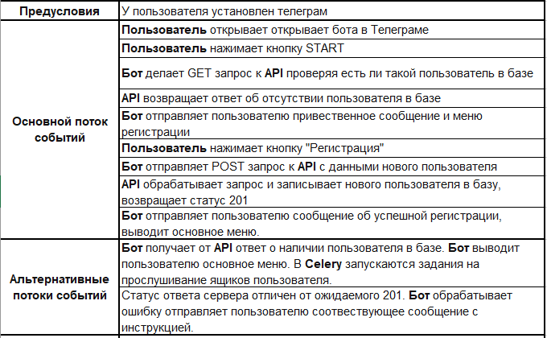

# Чат-бот для чтения электронной почты

Позволяет получать новые письма электронной почты в чат-боте для Telegram. Поддерживает возможность отслеживания нескольких ящиков и фильтрации писем по их отправителям.

## Основные технологии разработки продукта

- Python 3.10
- Django 4.1 (async)
- Aiogram
- Celery
- PostgreSQL 15
- Redis
- Docker

## Развертывание проекта

### Требования
- Установленный Docker и Docker Compose
- GNU Make

### Инструкция:
1. Склонируйте репозиторий
   ```bash
   git clone <ссылка на репозиторий>
   ```
2. Создайте файл .env и заполните его по примеру .env_example своими данными  
3. Поднимите контейнеры
   ```bash
   make up-d
   ```
4. Примените миграции
   ```bash
   make migrate
   ```
5. Соберите статику
   ```bash
   make collectstatic
   ```
6. Чтобы остановить контейнеры, выполните команду
   ```bash
   make down
   ```

## Использование ключевых внешних проектов или фреймворков

TBF

## Тестирование и стенды проекта

TBF

## High-level design


## Схема БД проекта


## Use cases

1. Регистрация пользователя в боте

    

2. Добавление пользователем нового почтового ящика для отслеживания

    

3. Получение пользователем нового email-сообщения от бота

    

## Структура веток проекта

- main - актуальная production ветка проекта
- develope - ветка основной разработки
